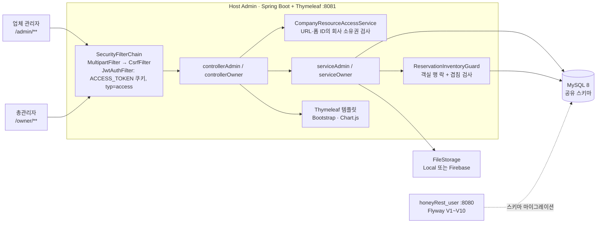

# HoneyRest – 숙소 예약 플랫폼 · 관리자 시스템

[](https://github.com/Seongwonp/honeyRest_host/actions/workflows/ci.yml)


**HoneyRest**의 운영자용 서버 렌더링(Thymeleaf) 관리자 앱입니다. 권한을 두 단계로 나눠
**업체 관리자(COMPANY_ADMIN)** 는 자기 회사의 숙소·객실·가격 캘린더·예약·리뷰·문의·매출만,
**총관리자(SUPER_ADMIN)** 는 전체 업체·숙소 승인·유저·쿠폰·환불을 관리합니다.
사용자 API와 **같은 MySQL 스키마를 공유**하므로 예약 상태와 재고 규칙을 두 저장소가 동일하게 적용하도록 맞췄습니다.

| 저장소 | 역할 |
|--------|------|
| [honeyRest_user](https://github.com/Seongwonp/honeyRest_user) | 사용자 REST API · 스키마(Flyway) 소유 |
| [honeyrest_user_react](https://github.com/Seongwonp/honeyrest_user_react) | 사용자 화면 · React 19 SPA |
| **honeyRest_host** (현재) | 업체 관리자 / 총관리자 화면 · Spring Boot + Thymeleaf |

---

## 역할

**팀 프로젝트 (2025.08.04 ~ 2025.09.04, 4주, 3명)**

| 이름 | 담당 |
|------|------|
| 김민경 | **업체 관리자(Company Admin) 총괄** — 시스템 전체 설계 및 개발, 숙소/객실 등록·예약 현황·매출 통계·리뷰 관리 구현, PPT 제작 참여 |
| 설현오 | **총 관리자(Super Admin) 총괄** — 시스템 전체 설계 및 개발, 업체/숙소/예약/유저 관리 및 쿠폰 시스템 구현, 백엔드 명세서 작성, PPT 제작 참여 |
| 박성원 (팀장) | 전체 DB 설계 및 ERD 작성 / 사용자(User) 영역 개발 총괄 / 관리자 시스템 기술 방향 결정(Thymeleaf) 및 전체 코드 리뷰 / 광고 영상 제작 |

**프로젝트 종료 후 단독 고도화 (2025.09 ~ , 박성원)**

- **권한·테넌트 경계**: SUPER_ADMIN 자가 승격 차단, 고정 비밀번호 초기화를 `local-demo` 프로필로 격리, 회사 소유권 검사 공통화(`CompanyResourceAccessService`), 숙소 승인을 총관리자 전용 워크플로로 분리
- **인증**: refresh token이 access token처럼 통용되던 문제 차단(`typ` 검증), `ACCESS_TOKEN` 쿠키 HttpOnly·SameSite=Lax·HTTPS 시 Secure
- **CSRF 재활성화**: 쿠키 기반 토큰 저장소 + 멀티파트 필터 순서 조정, 템플릿 34개에 토큰 적용
- **예약 재고 통일**: `total_rooms` 직접 증감 제거 → 사용자 API와 같은 객실 락 + 겹침 검사, 예약 상태 상수 통일(`CANCELED` 오타로 취소 집계가 0이던 버그 수정)
- **성능·정리**: 예약 조회 `JOIN FETCH`·`countQuery` 분리·`@EntityGraph`로 N+1 제거, 미사용 정적 에셋 68MB(6,199 → 186 파일)·템플릿·의존성 제거, 파일 저장소 추상화
- **운영 UX**: 역할별 테마 분리(업체: 앰버 / 총관리자: 네이비), 반응형 목록 재작성, 취소 요청 알림 배지(`NotificationInterceptor`), `alert()` → Toast
- **테스트·CI**: H2 test 프로필, 빈 테스트 재작성, GitHub Actions
- 상세 기록: [docs/STABILIZATION.md](docs/STABILIZATION.md)

---

## 기술 스택

| 구분 | 기술 |
|------|------|
| Language / Framework | Java 17, Spring Boot 3.5.4 (Web, Validation, Actuator) |
| View | Thymeleaf + Layout Dialect 3.1, Bootstrap 5.3, Mazer 관리자 템플릿, Chart.js |
| 인증 / 인가 | Spring Security (STATELESS), JJWT 0.12.5 — `ACCESS_TOKEN` HttpOnly 쿠키, CSRF(`CookieCsrfTokenRepository`) |
| 데이터 | MySQL 8, Spring Data JPA, QueryDSL 5.0, `ddl-auto=validate` (스키마는 사용자 API의 Flyway가 관리) |
| 매핑 | MapStruct 1.6, ModelMapper 3.2 |
| 캐시 | Spring Cache (`simple`, 인메모리) |
| 파일 저장 | `FileStorage` 추상화 — 로컬 디스크(기본) / Firebase Storage(선택) |
| 문서 | SpringDoc OpenAPI 2.5 (Swagger UI, SUPER_ADMIN 전용) |
| 테스트 / CI | JUnit 5, Mockito, Spring Boot Test, H2 (MySQL 모드), GitHub Actions |

> 패키지 이름 주의: `*Owner` 패키지와 `/owner/**` 경로가 **총관리자(SUPER_ADMIN)**, `*Admin` 패키지와 `/admin/**` 경로가 **업체 관리자(COMPANY_ADMIN)** 입니다. 이름이 직관과 반대입니다.

---

## 아키텍처



- 사용자 API가 스키마를 만들고(Flyway), 이 앱은 `validate`만 수행합니다. 매핑이 어긋나면 기동 단계에서 바로 실패하므로 두 저장소의 엔티티 차이가 운영 중 데이터 오류로 번지지 않습니다.
- 컬럼 명세: [DB_SCHEMA.md](DB_SCHEMA.md) (사용자 저장소와 동일 내용)

### 주요 기능

| 업체 관리자 (`/admin/**`) | 총관리자 (`/owner/**`) |
|---|---|
| 숙소·객실 등록/수정, 이미지 업로드 | 업체·숙소·객실 계층 탐색, 숙소 승인/거절 |
| 날짜별 가격·재고 캘린더 일괄 수정 | 전체 예약 조회, 숙소별 월간 예약 캘린더 |
| 예약 목록·상태 변경·환불 처리 | 업체별 매출 그래프, 결제·포인트·환불 관리 |
| 매출 KPI 대시보드 (7일 / 30일 / 월별) | 유저 조회, 업체 관리자 계정 생성 |
| 리뷰 답변·숨김, 1:1 문의 답변, 쿠폰 발행 | 쿠폰·이벤트, 전체 문의·신고 리뷰 처리 |

---

## 핵심 설계 결정 & 트러블슈팅

### 1. STATELESS 앱에서 CSRF 재활성화 — 쿠키 저장소 + 필터 순서
- **문제**: JWT 쿠키 인증인데 CSRF가 꺼져 있었고, 켜면 ① 세션이 없어 기본 저장소가 동작하지 않고 ② 이미지 업로드(멀티파트) 폼은 바디 파싱 전이라 `_csrf`를 못 읽어 항상 403 ③ 큰 페이지에서 응답 버퍼가 먼저 커밋돼 토큰 `Set-Cookie`가 누락됐습니다.
- **결정**: `CookieCsrfTokenRepository`로 전환, `MultipartFilter`를 빈으로 등록해 `CsrfFilter` 앞에 배치, 필터 체인 초입에서 지연 로딩되는 `CsrfToken`을 미리 읽는 필터 추가. POST 폼 템플릿 34개(로그인 포함)에 `_csrf` 적용.
- **결과**: 모든 폼·업로드·fetch 요청이 CSRF 검증을 통과하며, 회귀 테스트는 Spring Security 6의 토큰 마스킹(`XorCsrfTokenRequestAttributeHandler`)에 맞춰 실제 페이지에서 토큰을 읽도록 작성했습니다.
- 코드: [`SecurityConfig`](src/main/java/com/honeyrest/honeyrest_host/config/SecurityConfig.java)

### 2. 다른 회사 데이터가 보이던 IDOR — 소유권 검사 공통화 + fail-closed
- **문제**: 가격 캘린더·리뷰·문의 등 핸들러가 URL/폼의 `accommodationId`·`roomId`를 그대로 믿었고, 결제 조회는 principal 타입 버그로 `companyId`가 `null`이 되면 **전체 회사 데이터**를 반환했습니다.
- **결정**: 로그인 사용자 → 회사를 해석하고 숙소·객실·예약·리뷰·문의가 그 회사 소유인지 확인하는 `CompanyResourceAccessService`를 두고 컨트롤러 6개에서 호출. 입력이 `null`이거나 조회에 실패하면 `false`(거부)로 처리하고 저장소의 `null` 우회 조건을 제거했습니다. 예약 생성 폼은 객실과 숙소가 서로 다른 회사로 섞이지 않는지도 검사합니다.
- **결과**: 식별자를 바꿔도 타사 리소스는 읽기·쓰기 모두 실패하며, 거부 케이스를 단위 테스트로 고정했습니다.
- 코드: [`CompanyResourceAccessService`](src/main/java/com/honeyrest/honeyrest_host/serviceAdmin/CompanyResourceAccessService.java) · [테스트](src/test/java/com/honeyrest/honeyrest_host/serviceAdmin/CompanyResourceAccessServiceTest.java)

### 3. 권한 상승과 고정 비밀번호 — 가입 경로 분리 + 프로필 격리
- **문제**: 업체 관리자가 가입 API로 SUPER_ADMIN을 스스로 발급할 수 있었고, 고정 비밀번호 관리자 계정을 만드는 초기화 코드가 모든 환경에서 실행됐습니다.
- **결정**: 관리자 생성 API를 SUPER_ADMIN 전용으로 제한하고, `DataInitializer`를 `@Profile("local-demo")` 명시적 opt-in으로 전환(비밀번호는 프로퍼티로 재정의 가능). 숙소 승인·거절도 총관리자 전용 경로로 분리해 업체의 자가 승인을 막았습니다.
- **결과**: 익명·업체 관리자의 승격 시도는 거부되고, 테스트·일반 실행에서 계정이 생성되지 않습니다.
- 코드: [`DataInitializer`](src/main/java/com/honeyrest/honeyrest_host/config/DataInitializer.java) · [`OwnerAuthSignupSecurityTest`](src/test/java/com/honeyrest/honeyrest_host/security/OwnerAuthSignupSecurityTest.java)

### 4. refresh token으로도 인증되던 문제 — `typ` 클레임 검증
- **문제**: 14일짜리 refresh token이 access token과 똑같이 인증에 통용돼, 유출 시 1시간 access token 만료 정책이 무의미했습니다.
- **결정**: 토큰 발급 시 `typ` 클레임을 넣고 `JwtAuthFilter`는 `typ=access`만 인증에 사용. 로그인 쿠키는 `ResponseCookie`로 HttpOnly·SameSite=Lax, HTTPS 요청이면 Secure를 자동 설정합니다.
- **결과**: refresh token으로의 인증 시도는 차단·로그됩니다.
- 코드: [`JwtAuthFilter`](src/main/java/com/honeyrest/honeyrest_host/security/JwtAuthFilter.java) · [`JwtTokenProvider`](src/main/java/com/honeyrest/honeyrest_host/config/JwtTokenProvider.java) · [테스트](src/test/java/com/honeyrest/honeyrest_host/security/JwtAuthFilterTest.java)

### 5. 두 앱이 서로 다른 방식으로 재고를 다루던 문제 — `ReservationInventoryGuard`
- **문제**: 관리자 예약 생성은 `room.total_rooms`를 1 줄이고 취소 시 1 늘렸지만 사용자 API는 `total_rooms`를 건드리지 않아, 두 방식이 섞이면 객실 수 자체가 오염됐습니다. 상태 철자도 `CANCELED`/`CANCELLED`가 섞여 보고서의 취소 건수가 항상 0이었습니다.
- **결정**: 재고 = `total_rooms − 겹치는 점유 상태 예약 수`로 통일하고, `RoomRepository.findByIdForUpdate`(`PESSIMISTIC_WRITE`) 후 `countOverlapping`으로 검사하는 가드를 관리자·총관리자 예약 생성/수정 4곳에 적용(수정 시 자기 자신은 `excludeReservationId`로 제외). 상태는 사용자 저장소와 같은 `ReservationStatus` 상수로 통일했고, 공유 스키마에 없는 `@Version`은 제거했습니다.
- **결과**: 초과 예약은 409로 거절되고 화면에 사유가 표시됩니다. 재고 규칙은 단위 테스트 14건으로 고정했습니다.
- 코드: [`ReservationInventoryGuard`](src/main/java/com/honeyrest/honeyrest_host/serviceCommon/ReservationInventoryGuard.java) · [`ReservationStatus`](src/main/java/com/honeyrest/honeyrest_host/entity/ReservationStatus.java) · [테스트](src/test/java/com/honeyrest/honeyrest_host/serviceAdmin/ReservationServiceImplInventoryTest.java)

### 6. 예약 목록 N+1과 메모리 페이징 — `JOIN FETCH` + `countQuery` 분리
- **문제**: 예약 목록에서 객실·숙소 등 연관 엔티티를 지연 로딩하며 행마다 추가 쿼리가 발생했고, 일부 `Page` 쿼리는 Hibernate 메모리 페이징 경고를 냈습니다.
- **결정**: `ReservationRepository` 조회에 `JOIN FETCH`를 적용하고 `Page` 쿼리는 `value`/`countQuery`를 분리, 총관리자 숙소 조회는 `@EntityGraph`로 연관을 일괄 로딩했습니다. 총관리자 예약 목록은 상태 필터를 DB 쿼리에서 처리해 목록 건수와 `total`을 일치시켰습니다.
- **결과**: 목록 조회 쿼리 수가 행 수와 무관해졌고, 상태 필터 JPQL 4종의 목록·count 정합성을 테스트로 검증합니다.
- 코드: [`ReservationRepository`](src/main/java/com/honeyrest/honeyrest_host/repositoryAdmin/ReservationRepository.java) · [`OAccommodationRepository`](src/main/java/com/honeyrest/honeyrest_host/repositoryOwner/OAccommodationRepository.java) · [테스트](src/test/java/com/honeyrest/honeyrest_host/repositoryOwner/OReservationRepositoryStatusQueryTest.java)

### 7. Firebase 키·68MB 정적 에셋 의존 — 저장소 추상화와 정리
- **문제**: 업로드가 Firebase에 직접 묶여 서비스 계정 키 없이는 실행되지 않았고, 템플릿 원본에서 가져온 미사용 에셋이 저장소에 68MB 남아 있었습니다.
- **결정**: `FileStorage` 인터페이스 + `LocalFileStorage`(기본) / `FirebaseFileStorage`를 `app.storage.type`으로 선택하고, `FirebaseConfig`는 firebase 모드에서만 로드. 미사용 에셋(6,199 → 186 파일)·템플릿·의존성(oauth2-client, websocket, mail, aop 등)을 제거했습니다.
- **결과**: 외부 키 없이 로컬 실행·CI가 가능하고 저장소 크기가 크게 줄었습니다.
- 코드: [`storage/`](src/main/java/com/honeyrest/honeyrest_host/storage)

---

## 실행 방법

**필요 환경**: JDK 17, MySQL 8 (`honeyrest_db`). 스키마는 [사용자 API](https://github.com/Seongwonp/honeyRest_user)를 한 번 기동해 Flyway(V1~V10)로 먼저 만들어 둡니다.

1. **시크릿 파일**: `src/main/resources/application_security.properties.ex`를 복사해 같은 폴더에 `application_security.properties`를 만들고 `spring.datasource.password`, `jwt.secret`을 채웁니다(gitignore 대상).
2. **파일 저장소**: 기본값 `app.storage.type=local`(업로드는 `./uploads`, `/uploads/**`로 서빙)이라 Firebase 키 없이 실행됩니다. Firebase를 쓰려면 `--app.storage.type=firebase --app.firebase.credentials=file:/경로/키.json`.
3. **실행**
   ```bash
   ./gradlew bootRun                                                # http://localhost:8081
   ./gradlew bootRun --args='--spring.profiles.active=local-demo'   # 데모 관리자 계정 생성
   ```
4. **데이터 시드**: [`db/seed/`](db/seed) — `insert.sql` → `insert_pk_1-20.sql` → `insert_pk_21-30.sql` → `insert_pk_31-33.sql` 순서(FK 의존 순). 로컬 저장소 모드에서 이미지를 보려면 사용자 저장소의 [`scripts/seed-local-images.sql`](https://github.com/Seongwonp/honeyRest_user/blob/main/scripts/seed-local-images.sql)도 실행합니다.
5. **데모 계정**: `local-demo` 프로필에서 [`DataInitializer`](src/main/java/com/honeyrest/honeyrest_host/config/DataInitializer.java)가 업체 관리자·총관리자 계정을 생성합니다. 이메일·기본 비밀번호는 해당 파일에 정의되어 있으며 `demo.company-admin.password`, `demo.super-admin.password` 프로퍼티로 바꿀 수 있습니다.
6. **포트**: 관리자 앱 `8081`(`SERVER_PORT`로 변경) · User API `8080` · React `5173`

로그인: `http://localhost:8081/auth/login` → 역할에 따라 `/admin/dashboard` 또는 `/owner/dashboard`로 이동

---

## 테스트 & CI

```bash
./gradlew test     # MySQL·시크릿 파일·Firebase 없이 실행
./gradlew build    # CI와 동일
```

- **52개 테스트** — 회사 소유권(`CompanyResourceAccessServiceTest`), 권한 상승 차단(`OwnerAuthSignupSecurityTest`), `typ` 검증(`JwtAuthFilterTest`), 재고 가드(`ReservationServiceImplInventoryTest`, `OReservationServiceInventoryTest`), 상태 상수, 예약 수정 컨트롤러, 상태 필터 JPQL 페이지·count 정합
- **test 프로필**: H2 인메모리(MySQL 모드, `NON_KEYWORDS=USER`) + `create-drop` + 더미 `jwt.secret` + `app.storage.type=local`. 통합 테스트는 `JpaTestFixtures`로 데이터를 만들고 트랜잭션 롤백하므로 하드코딩 ID나 실 DB에 의존하지 않습니다(이전에는 46개 중 10개가 로컬 MySQL 부재로 실패).
- **트레이드오프**: 스키마를 엔티티 매핑에서 생성하므로 **운영 MySQL 스키마(Flyway)와의 차이는 테스트로 잡지 못합니다.** 운영에서는 `ddl-auto=validate`가 기동 시점에 이를 검출하며, Testcontainers 도입이 후속 과제입니다.
- **CI**: [GitHub Actions](.github/workflows/ci.yml) — `main` push/PR마다 JDK 17로 `./gradlew build`, 실패 시 테스트 리포트 업로드

---

## 화면

관리자 화면 캡처는 이 저장소에 아직 없으며 추후 추가 예정입니다. 같은 데이터를 쓰는 사용자 화면은 React 저장소에서 볼 수 있습니다: [honeyrest_user_react · 화면](https://github.com/Seongwonp/honeyrest_user_react#화면)

| 사용자 숙소 검색 | 사용자 숙소 상세 · 객실 선택 |
|------|------|
|  |  |

- 관리자 시연 영상: 추후 GitHub Release에 첨부 예정
- 발표 자료: [HoneyRest.pdf](https://github.com/user-attachments/files/22292418/HoneyRest.pdf)

---

## 회고

### 김민경 – 업체 관리자 (Company Admin) 담당

이번 최종 프로젝트는 설레는 기대감과 함께 긴장도 컸습니다.
진행 과정에서 흥미와 성취감을 느끼는 순간도 있었지만, 반복되는 오류와 시행착오로 어려움을 겪기도 했습니다.
특히 JPA를 활용한 개발 과정은 새로운 개념을 배우고 적용해 나가는 값진 시간이었으며,
문제 상황에서는 팀원들과의 적극적인 소통을 통해 해결 능력을 넓힐 수 있었습니다.

아쉬운 점이 있다면, 다소 짧게 느껴진 프로젝트 기간으로 인해 구현하지 못한 기능들이 남았다는 것입니다.
그럼에도 끝까지 협력하며 프로젝트를 완성할 수 있었던 것은 팀원들의 헌신과 지원 덕분입니다.

### 설현오 – 총 관리자 (Super Admin) 담당

이번 프로젝트를 통해 단순히 개발 기술을 익히는 것뿐만 아니라
전체적인 흐름을 관리하고 조율하는 역할의 중요성을 깊이 체감할 수 있었습니다.
프론트와 백엔드까지 종합적으로 고려해야 했기 때문에 부담도 있었지만 그만큼 배운 점도 많았습니다.

특히 프로젝트 초반에 설계와 기획을 얼마나 세밀하게 준비하느냐가
이후 진행 속도와 완성도에 큰 영향을 준다는 것을 느꼈습니다.
팀원들과의 꾸준한 소통이 문제 해결의 핵심이었고, 혼자가 아닌 팀으로서 성장하는 경험을 할 수 있었습니다.

이번 프로젝트는 저에게 큰 도전이자 값진 배움의 시간이었고,
이후 더 나은 개발자로 성장할 수 있는 발판이 되었다고 생각합니다.

### 박성원 – 팀장 / 사용자 영역

- [프로젝트 회고 (honeyRest_user/docs/RETROSPECTIVE.md)](https://github.com/Seongwonp/honeyRest_user/blob/main/docs/RETROSPECTIVE.md)
